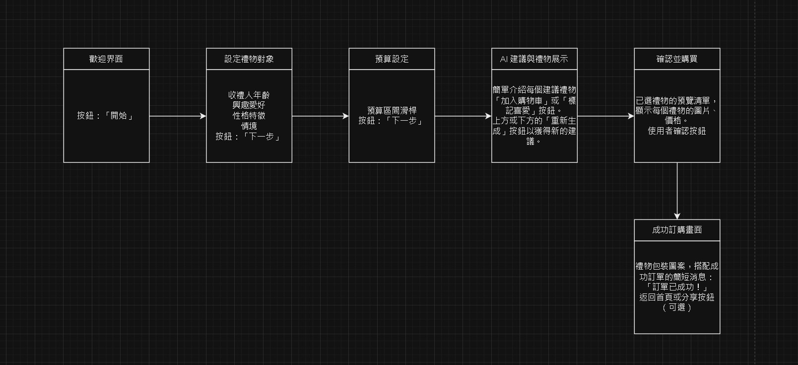

# HW6

## 說明
使用者需求分析
節省時間：透過 AI 直接推薦，省去繁瑣的篩選過程。
提升選禮精準度：根據收禮人的年齡、興趣、性格等資訊，AI 能精準推薦適合的禮物。
控制預算：應用允許使用者設置預算範圍，減少超出預算的情況。
簡單購買流程：一站式的流程設計讓使用者從推薦到購買無縫銜接。
應用流程分析
多步驟引導：分步引導使用者逐一設定需求，提高應用的使用體驗。
即時推薦：根據輸入資料，AI 可立即提供推薦結果，增強互動性。
個性化服務：使用者可以通過「重新生成」選項獲得更多推薦，增加選擇的靈活性。
